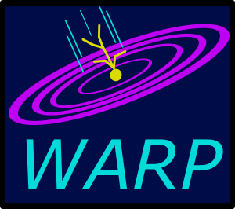

# Warp



## About

Warp is a research programming language used to explore how the parts of a
modern programming language stack fit together.

The key features of Warp are the following:
* A bytecode-based virtual machine
* Garbage-collected memory allocation
* Lisp syntax and macros
* Tail Recursion
* An interactive REPL environment

_Warp is far from complete and not actively supported, please do not hook up your pace maker to it._

## A Very Small Example

```clojure
(defn fib (start)
  (let loop (prev1 0 
             prev2 1
             n n)
    (if (= n 0)
      prev2
      (loop prev2 (+ prev1 prev2) (- n 1)))))
```

For more examples, check out the [standard library](src/core.lsp).

## Building and Runing

```sh
$ brew install check cmake
```

Then, in the root of the repo:

``` sh
$ mkdir -p build
$ cmake ../
$ make all
```

This will generate a binary called `repl-main`, which is the primary means of
interacting with Warp. Run it, and you will be presented with a prompt with
which you can evaluate Warp code.

You can also run the test suite with `make test`.

## Supported Environments

I have only tested Warp on MacOS, YMMV on other operating systems.


